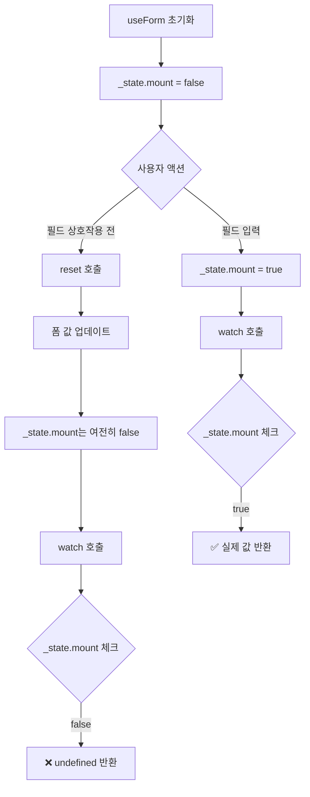

## 문제 발견

react-hook-form에 기여를 하고 싶어 이슈를 들락날락 하다가 찾았습니다. React Hook Form 7.63.0 버전부터 발생한 버그였는데, <strong>reset()</strong> 메서드를 호출한 직후 <strong>watch()</strong> 메서드가 <strong>undefined</strong>를 반환하는 문제였습니다.

정상적인 상황이라면 <strong>reset()</strong>으로 폼 값을 초기화한 후 <strong>watch()</strong>를 호출하면 초기화된 값이 반환되어야 하는데, 특정 조건에서 <strong>undefined</strong>가 반환됐습니다.

특히 이 문제는 사용자가 필드와 상호작용하기 전에 <strong>reset()</strong>을 호출했을 때 발생했습니다.

## 원인 분석

React Hook Form의 내부 구조를 깊이 분석한 결과, 문제의 근본 원인을 찾을 수 있었습니다.

### \_state.mount의 역할

React Hook Form은 내부적으로 <strong>\_state.mount</strong>라는 플래그를 사용하여 폼이 "마운트"되었는지 추적합니다. 이 플래그는 다음과 같은 역할을 합니다:

- 초기값: <strong>false</strong>
- 사용자가 필드와 상호작용(입력, 포커스 등)하면 <strong>true</strong>로 변경됨
- <strong>watch()</strong> 메서드가 어떤 값을 반환할지 결정하는 중요한 조건

### 버그가 발생한 이유

<strong>watch()</strong> 메서드 내부의 <strong>_getWatch</strong> 함수는 다음과 같은
로직으로 동작합니다:

```typescript
// 간소화된 _getWatch 로직
function _getWatch(names, defaultValue) {
  // _state.mount가 false면 defaultValue 반환
  if (!_state.mount) {
    return defaultValue;
  }

  // _state.mount가 true면 실제 폼 값 반환
  return getFieldValue(names);
}
```

문제는 <strong>reset()</strong> 메서드에서 발생했습니다:

1. 사용자가 필드와 상호작용하기 전에 <strong>reset()</strong>을 호출
2. <strong>reset()</strong>은 내부적으로 폼 값을 업데이트하지만, <strong>
     _state.mount
   </strong>는 여전히 <strong>false</strong>
3. 이후 <strong>watch()</strong>를 호출하면 <strong>\_getWatch</strong>가 <strong>\_state.mount === false</strong>를 확인
4. 업데이트된 폼 값 대신 <strong>defaultValue</strong>(undefined)를 반환

### 재현 조건

```typescript
// 버그 재현 코드
const { reset, watch } = useForm({
  defaultValues: { name: "initial" },
});

// 사용자가 필드와 상호작용하기 전에 reset 호출
reset({ name: "updated" });

// undefined 반환! (기대값: 'updated')
console.log(watch("name"));
```

이 버그는 7.63.0 버전의 리팩토링 과정에서 <strong>reset()</strong> 함수가 <strong>\_state.mount</strong>를 적절히 업데이트하지 않으면서 발생했습니다.

### 버그 발생 플로우



## 해결 방법

해결책은 <strong>reset()</strong> 함수 내부에서 <strong>\_state.mount</strong>의 값을 결정하는 조건부 로직을 수정하는 것이었습니다.

### 기존 코드 (버그 발생)

```typescript
// createFormControl.ts의 _reset 함수 내부
_state.mount =
  !_proxyFormState.isValid ||
  !!keepStateOptions.keepIsValid ||
  !!keepStateOptions.keepDirtyValues;
```

기존 로직은 폼의 validation 상태와 keep 옵션에만 의존하고 있었습니다. 이로 인해 <strong>reset()</strong>으로 값을 설정해도 <strong>\_state.mount</strong>가 <strong>false</strong>로 남아있는 경우가 발생했습니다.

### 수정된 코드

```typescript
_state.mount =
  !_proxyFormState.isValid ||
  !!keepStateOptions.keepIsValid ||
  !!keepStateOptions.keepDirtyValues ||
  (!_options.shouldUnregister && !isEmptyObject(values)); // 이 조건 추가
```

해결책은 간단합니다. 기존 조건에 `(!_options.shouldUnregister && !isEmptyObject(values))` 조건을 추가했습니다.

이 조건은 "필드 등록을 해제하지 않으면서 값이 비어있지 않은 경우"를 의미합니다. <strong>reset()</strong>으로 값을 설정하면 <strong>values</strong>가 비어있지 않게 되므로, <strong>\_state.mount</strong>가 <strong>true</strong>로 설정되어 <strong>watch()</strong>가 올바른 값을 반환하게 됩니다.

### 테스트 케이스 추가

또한 이 버그가 재발하지 않도록 테스트 케이스도 추가했습니다:

```typescript
it("should return correct value after reset when _state.mount is false", () => {
  const { watch, reset, getValues } = useForm({
    defaultValues: { name: "initial" },
  });

  reset({ name: "updated" });

  expect(watch("name")).toBe("updated");
  expect(getValues("name")).toBe("updated");
});
```

## 리뷰 과정

PR을 올린 후 메인테이너인 @bluebill1049님으로부터 빠른 피드백을 받았습니다.

처음에는 dirty values와 valid state에 대한 잠재적인 리그레션에 대한 우려가 있었습니다. 이는 매우 합리적인 지적이었고, 기존 코드의 조건부 마운트 체크를 유지하면서도 버그를 해결할 수 있도록 솔루션을 개선했습니다.

메인테이너의 빠르고 명확한 피드백 덕분에 금방 문제를 해결할 수 있었고, 결과적으로 PR은 머지됐습니다.

---

**참고 링크:**

- [Pull Request #13091](https://github.com/react-hook-form/react-hook-form/pull/13091)
- [Issue #13088](https://github.com/react-hook-form/react-hook-form/issues/13088)
